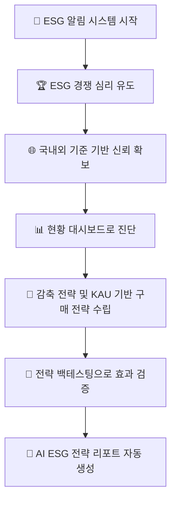
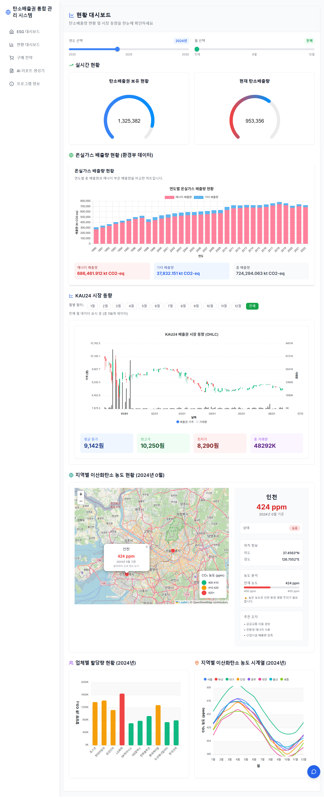
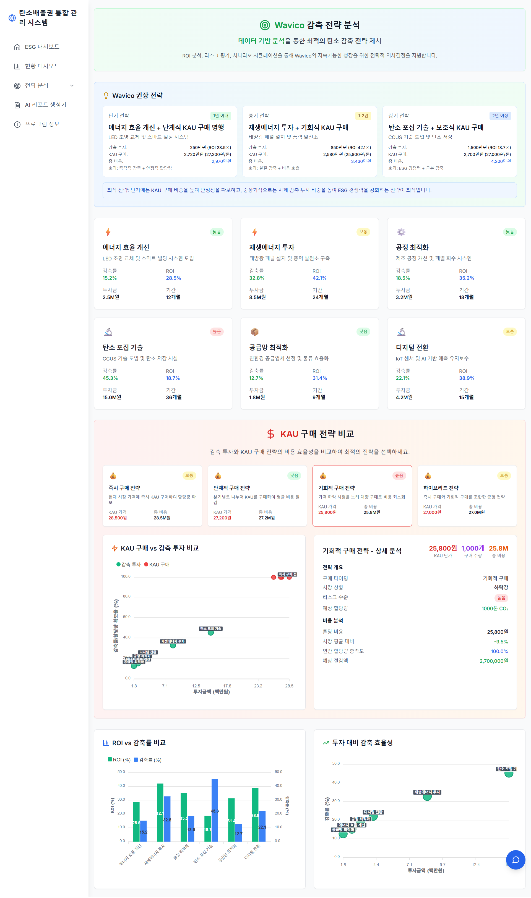
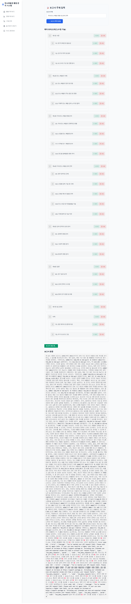

# 🌿 탄소배출권 통합 관리 시스템 – 핵심 UX 흐름 요약

## 📢 전체 UX 전략 흐름

---

## 🎯 핵심 기능별 UX 요약

### 🔔 **1. ESG 알림 시스템**

- **목적**: 탄소 수급 위험, 시세 급등 등 이상 징후 자동 탐지
- **UX**: 요약 알림 → 대시보드 진입 유도
- **효과**: 즉각적인 위험 인지 및 대응

_ESG 알림과 필터링 시스템 - 실시간 위험 탐지 및 대응_

### 🏆 **2. ESG 경쟁 기반 유도**

- **목적**: 업종 내 ESG 점수/등급/순위 공개
- **UX**: 배지, 인증 마크로 행동 동기 유발
- **효과**: 게이미피케이션 기반 리더보드로 경쟁 심리 활용

.png>).png>)
_ESG 점수와 순위 시스템 - 경쟁 기반 동기 부여_

### 🌐 **3. 공신력 기반 점수화**

- **목적**: GRI 305, SASB, DJSI, K-ESG 등 국제 기준 적용
- **UX**: 기준별 탭/캐러셀 + 종합 점수 이중 구조
- **효과**: 신뢰할 수 있는 평가 체계 구축

.png>)
_국제 기준 기반 ESG 평가 시스템 - 신뢰성 확보_

### 📊 **4. 현황 대시보드**

- **목적**: 온실가스 배출량, 배출권 잔여량, 시장 동향 파악
- **UX**: 연도/월 필터링, 지도 기반 농도 시각화
- **효과**: 직관적인 현황 파악 및 데이터 기반 의사결정

![현황 대시보드]
_통합 현황 대시보드 - 실시간 현황, 온실가스 배출량, 시장 동향, 지역별 CO2 농도_

### 🧠 **5. 감축 전략 분석**

- **목적**: 감축률 목표 설정 → 투자 대비 효과 분석
- **UX**: 업종/정부 기준 대비 성과 자동 평가
- **효과**: 최적 감축 조합 제안으로 효율성 극대화

![감축 전략 분석]
_감축 전략 분석 시스템 - 전략 비교와 성과 분석_

### 💹 **6. 구매 전략 수립**

- **목적**: 실시간 KAU24 데이터 기반 전략 수립
- **UX**: 가격/수급/시기 기반 AI 추천 전략
- **효과**: 예산, 리스크 기반 시뮬레이션으로 안전한 투자

![구매 전략 수립].png>)
_구매 전략 대시보드 - Quick Stats, 시장 동향, 백테스팅 시스템_

### 🔁 **7. 전략 백테스팅**

- **목적**: 과거 시장 데이터 기반 전략 효과 검증
- **UX**: "과거 3년간 적용 시 X억원 절감" 정량 분석
- **효과**: 성과 히트맵 + 수치 요약으로 객관적 평가

![전략 백테스팅].png>)
_백테스팅 결과 - 월별 성과 히트맵과 수치 요약_

### 📄 **8. AI ESG 전략 리포트 자동 생성**

- **목적**: 분석된 모든 ESG 지표, 전략 결과, 감축 시뮬레이션을 바탕으로 자동 보고서 생성
- **UX**: 클릭 한 번으로 경영진 보고용, 기관 제출용 문서 출력
- **구성**: 기업 ESG 점수 요약, 전략 성과 비교, 시장 동향, AI 기반 전략적 제언

_AI 리포트 생성기 - 드래그 앤 드롭 목차 편집과 PDF 업로드_

---

## 🎯 시스템 목표 요약

**탄소배출권 통합 관리 시스템**은 ESG 진단 → 전략 수립 → 검증 → 리포트 생성까지 **전 주기를 데이터 기반으로 자동화한 ESG 행동 유도 플랫폼**입니다.

### 📌 핵심 가치 제안

1. **자동화된 ESG 관리**: 수동 작업을 최소화하고 데이터 기반 의사결정 지원
2. **경쟁 기반 동기 부여**: 게이미피케이션으로 지속적인 ESG 개선 유도
3. **신뢰성 확보**: 국제 기준 기반 평가로 객관성과 공신력 확보
4. **전략적 접근**: 감축과 구매 전략을 통합하여 최적의 ESG 성과 달성

### 🚀 기대 효과

- **기업**: ESG 관리 효율성 증대 및 투명성 향상
- **투자자**: 객관적 ESG 평가 및 투자 의사결정 지원
- **사회**: 탄소 중립 목표 달성에 기여하는 지속가능한 생태계 구축

---

**🌍 지속가능한 미래를 위한 데이터 기반 ESG 플랫폼**
